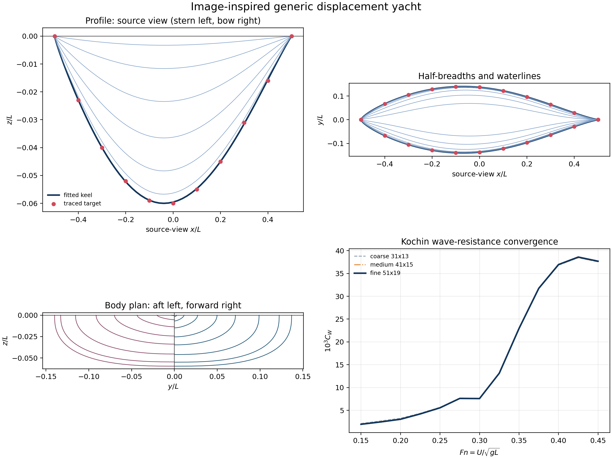
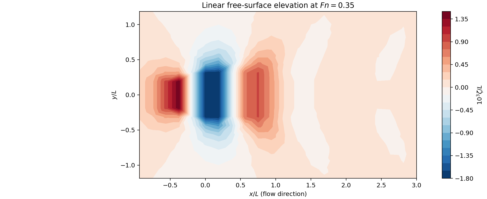

# Wave resistance of displacement yachts

`wave-resistance` is a transparent Python research code for the steady,
deep-water wave-making resistance of symmetric displacement monohulls. Version
0.2 replaces the original thin-ship-only implementation with a three-dimensional
Rankine-source formulation, a triangular hull panel model, a positive-definite
Kochin far-field resistance integral, and an experimental coupled free-surface
field solver.

The code predicts **wave-making resistance only**. It is not a total-resistance,
powering, velocity-prediction, or sailing-equilibrium program. Viscous drag,
appendages, heel, leeway, sinkage, trim, breaking waves, finite depth, roughness,
windage, and propulsion are outside version 0.2.

## Method in one paragraph

The mean immersed surface is triangulated on one half of a symmetric hull. A
linear Havelock source strength `sigma=-n_x` is assigned to each three-dimensional
panel. Its full breadth, depth, area, and transverse phase enter a Kochin
far-field integral, so the method is not restricted to a centreplane thin-ship
surface. An independent boundary-element solve enforces impermeability on the
hull and the linear free-surface condition on a finite Rankine-source domain;
it provides wave-elevation, pressure, matrix, and resolution diagnostics. The
Kochin integral remains the reported resistance because it is positive definite
and does not depend on truncating the numerical free-surface domain.

See [METHODOLOGY.md](docs/METHODOLOGY.md) for the complete equations and
[VALIDATION.md](docs/VALIDATION.md) for the evidence and current limitations.

## Installation

Python 3.9 or later and NumPy are required:

```bash
python -m pip install -e .
```

Optional packages provide plotting, tests, and GMRES for large systems:

```bash
python -m pip install -e '.[dev]'
```

The dense NumPy solver is always available. SciPy is used automatically for
systems larger than `SolverSettings.direct_unknown_limit` when installed.

## Quick start

```python
import numpy as np

from wave_resistance import LinearFreeSurfaceSolver, image_inspired_yacht

hull = image_inspired_yacht()
result = LinearFreeSurfaceSolver().solve(
    hull,
    np.arange(0.20, 0.451, 0.05),
    retain_wave_fields=True,
)

print(result.wave_resistance_coefficient)      # primary Kochin C_W
print(result.near_field_pressure_coefficient)  # finite-domain diagnostic
print(result.diagnostics[0].flags)
result.to_csv("resistance.csv")
result.wave_fields_to_npz("wave_fields.npz")
```

The coefficient and dimensional force are

\[
C_W=\frac{R_W}{\tfrac12\rho U^2S},\qquad
R_W=\tfrac12\rho U^2S C_W,\qquad
Fn=\frac{U}{\sqrt{gL}},
\]

where `L` is the declared reference waterline length and `S` is the static
bare-canoe wetted area calculated from the panels.

## Generic image-inspired yacht

The first example reconstructs the immersed character of the uploaded raster
lines plan: a fine bow, fuller stern, smooth keel rocker, rounded bilges, and
U-shaped midbody. The source drawing contains neither dimensions nor recoverable
vector offsets, so the example is deliberately nondimensional:

- `LWL = 1`;
- `BWL/LWL = 0.28`;
- `Tc/LWL = 0.06`;
- bare, upright canoe body only.

It is a **generic geometry, not a Dufour 39 reconstruction**. Details of the
tracing and fit are in [GEOMETRY_RECONSTRUCTION.md](docs/GEOMETRY_RECONSTRUCTION.md).

Run the complete reproducible example:

```bash
MPLCONFIGDIR=/tmp/wave-resistance-mpl \
  python examples/image_inspired_yacht.py
```





The committed outputs include normalized offsets and metadata, the resistance
curve, three-grid convergence data, the free-surface field, and both figures.
For `Fn >= 0.20`, the maximum change from the `41 x 15` to `51 x 19` hull grid
is 1.7%. At `Fn=0.15-0.175`, relative convergence is slower and reaches 3.5%.

## Journal-style test case

The [LaTeX article](article/main.tex) applies the method to a 10 m version of
the image-inspired yacht in seawater. It contains the full formulation,
hydrostatics, a three-grid study, Wigley/Michell verification, Kochin spectra,
and normalized wave-pattern maps at six Froude numbers from 0.20 to 0.45. The
compiled [manuscript](article/main.pdf) uses the JFM class and VOILAb writing
guidelines from the supplied Overleaf project.

Regenerate every tabulated result and figure with:

```bash
python examples/journal_test_case.py
```

The exact CSV, JSON and NPZ data are in [`article/data`](article/data), and all
publication figures are in [`article/figures`](article/figures).

## Command line

```bash
wave-resistance \
  --hull image-inspired \
  --fn 0.20:0.45:0.05 \
  --retain-wave-fields \
  --output-dir output/run
```

Canonical external offsets use one row per ordered section point:

```text
station_index,point_index,x_m,z_m,half_breadth_m
0,0,-0.5,0.0,0.0
...
```

Coordinates are body fixed: `x` increases from bow to stern with the oncoming
flow, `y` is positive to starboard, and `z` is positive upwards. Each station
runs from the waterline to the keel or centreline. Use `--hull csv --offsets
hull.csv --metadata hull.json` for external geometry.

## Verification

Run the dependency-free test suite with:

```bash
PYTHONPATH=src python -m unittest discover -s tests -v
```

Or, after installing the test extra:

```bash
python -m pytest
```

The 20 tests cover geometry and hydrostatics, source kernels, singular jump terms,
free-surface exclusion, dimensional scaling, exports, numerical residuals,
Kochin tails, and a slender Wigley limit. On a `41 x 15` half-hull grid, the
three-dimensional Kochin result agrees with the independent Michell solution
within 6% for all five points from `Fn=0.20` to `0.40`.

## Scientific interpretation

The generic yacht has `B/L=0.28` and therefore lies well outside strict
thin-ship proportions. The three-dimensional phase treatment is more suitable
than applying Michell's centreplane formula directly, but the current linear
source model is still a screening method. The coupled near-field pressure and
finite wave-cut diagnostics do not yet agree with the Kochin force to 5% on the
compact default free-surface grid; every result records this discrepancy as a
flag. Do not use the curve for design certification or powering without
validation against fixed-attitude towing-tank, wave-pattern, or CFD data.

## References

- J. H. Michell, “The wave-resistance of a ship,” *Philosophical Magazine*,
  1898, [doi:10.1080/14786449808621111](https://doi.org/10.1080/14786449808621111).
- N. E. Markov and K. Suzuki, “Fundamental studies on Rankine source panel
  method fully based on B-splines,” 2000,
  [doi:10.2534/jjasnaoe1968.2000.13](https://doi.org/10.2534/jjasnaoe1968.2000.13).
- D. Feng et al., “Numerical calculation of free-surface potential flow around
  a ship using the modified Rankine source panel method,” *Ocean Engineering*,
  2008, [doi:10.1016/j.oceaneng.2007.11.004](https://doi.org/10.1016/j.oceaneng.2007.11.004).
- ITTC, “Wave Profile Measurement and Wave Pattern Resistance Analysis,”
  Procedure 7.5-02-02-04, 2021,
  [PDF](https://www.ittc.info/media/11790/75-02-02-04.pdf).
