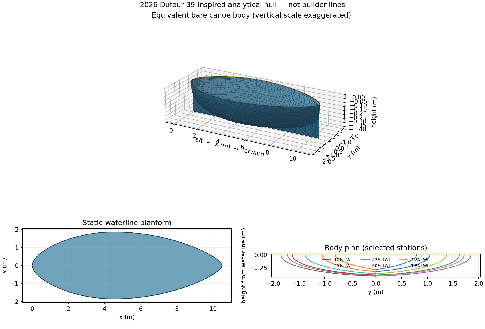
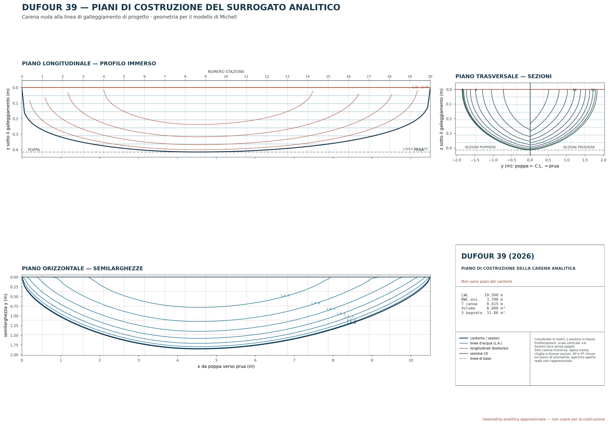
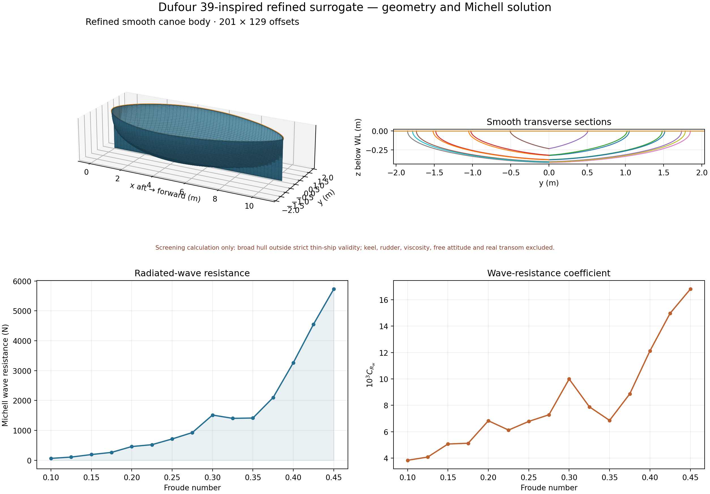

# Dufour 39-inspired hull: geometry and wave-resistance report

## Status and scope

This example is an analytical underwater surrogate inspired by the 2026 Dufour 39. It is not based on builder offsets and is not a reproduction of the production hull. It demonstrates the geometry interface and Michell solver on a modern, broad sailing-yacht form.

The calculation represents the fixed-attitude bare canoe body in calm, infinitely deep water. It excludes keel, rudder, appendages, viscosity, wave breaking, sinkage and trim, and replaces the yacht's open transom with the pointed closure required by the present thin-ship formulation. The results are therefore screening estimates, not powering predictions.

## Public particulars and analytical assumptions

The public reference is the [Dufour Yachts Dufour 39 specification](https://www.dufour-yachts.com/en/sailboats/dufour-39/). The published dimensions used for context are:

| Quantity | Value |
|---|---:|
| Length overall | 12.00 m |
| Hull length | 11.27 m |
| Length at waterline | 10.50 m |
| Maximum hull beam | 4.10 m |
| Total draft | 1.95 m |
| Unloaded displacement | 8,600 kg |

Because no public builder offsets were available, the underwater model additionally assumes a 3.70 m waterline beam and an 8.00 m³ bare-canoe displacement volume. The maximum published beam belongs primarily to the topsides and is retained only as metadata.

## Geometry definition

Let \(\xi=x/L\), with the aft forced point at \(\xi=0\), the forward point at \(\xi=1\), and maximum breadth at \(\xi=0.43\). The longitudinal fullness is a piecewise sine power, with exponents 0.55 aft and 0.65 forward. For normalized local depth \(r\), the sections are

\[
z=T f^{0.45}r,\qquad
Y=\frac{B_{WL}}{2}f\left(1-r^p\right)^q,
\]

where \(p=2.15-0.30(1-f)-0.28b^2\), \(q=0.62+0.16(1-f)+0.16b^2\), and \(b=\max[0,\min(1,(\xi-0.62)/0.38)]\). This gives rounded, continuously varying sections with increasing V-form towards the bow and no imposed chine. The draft is solved from the target volume. The tensor has 201 stations and 129 cosine-spaced vertical levels.

| Derived property | Value |
|---|---:|
| Reference length | 10.500 m |
| Represented waterline beam | 3.700 m |
| Canoe-body draft | 0.4148 m |
| Displaced volume | 8.000 m³ |
| Wetted area | 31.905 m² |
| Prismatic coefficient | 0.6501 |
| Block coefficient | 0.4480 |
| LCB from aft point | 0.4723 L |





## Michell calculation

The solver evaluates 15 Froude numbers from 0.10 to 0.45 in increments of 0.025, using seawater density 1025 kg/m³, \(g=9.80665\) m/s², relative tolerance \(10^{-5}\), absolute nondimensional tolerance \(10^{-12}\), and phase-aware tail certification. All points converged; the maximum reported tail fraction was \(6.39\times10^{-6}\). A separate default-tolerance calculation at \(Fn=0.30\) gave 1514.3558 N, differing from the sweep value by \(1.83\times10^{-7}\) relative.



| Fn | Speed (kn) | \(R_W\) (N) | \(10^3 C_{R_w}\) |
|---:|---:|---:|---:|
| 0.100 | 1.973 | 64.647 | 3.8396 |
| 0.125 | 2.466 | 107.489 | 4.0858 |
| 0.150 | 2.959 | 192.236 | 5.0744 |
| 0.175 | 3.452 | 264.535 | 5.1303 |
| 0.200 | 3.945 | 460.281 | 6.8344 |
| 0.225 | 4.438 | 522.349 | 6.1282 |
| 0.250 | 4.931 | 713.883 | 6.7839 |
| 0.275 | 5.424 | 927.799 | 7.2866 |
| 0.300 | 5.917 | 1514.356 | 9.9935 |
| 0.325 | 6.411 | 1403.553 | 7.8922 |
| 0.350 | 6.904 | 1414.877 | 6.8599 |
| 0.375 | 7.397 | 2099.337 | 8.8665 |
| 0.400 | 7.890 | 3266.211 | 12.1243 |
| 0.425 | 8.383 | 4554.033 | 14.9745 |
| 0.450 | 8.876 | 5728.440 | 16.8014 |

The curve exhibits a Michell interference hump around \(Fn=0.30\), a hollow near 0.33–0.35, and a strong rise above approximately 0.375. These features belong to the linearized surrogate and must not be interpreted as validated features of the production yacht.

## Applicability and uncertainty

Every point carries validity warnings. The metadata beam-to-length ratio is 0.39, the represented waterline ratio is approximately 0.35, and maximum longitudinal half-breadth slope is about 3.9 near the forced pointed closure. These challenge Michell's slender-body assumptions. Numerical convergence certifies evaluation of the mathematical model, not model-form accuracy.

A defensible yacht prediction would require measured or builder geometry, explicit transom treatment, free sinkage and trim, appendage and viscous contributions, and comparison with towing-tank or CFD data.

## Reproduction

```bash
python -m pip install -e '.[plot,test]'
python examples/dufour_39_hull.py
python examples/dufour_39_lines_plan.py
python examples/dufour_39_refined_analysis.py
python -m pytest
```

Machine-readable inputs and outputs are `dufour_39_offsets.csv`, `dufour_39_metadata.json`, and `dufour_39_refined_resistance.csv`. The scripts contain all analytical parameters used to generate them.
