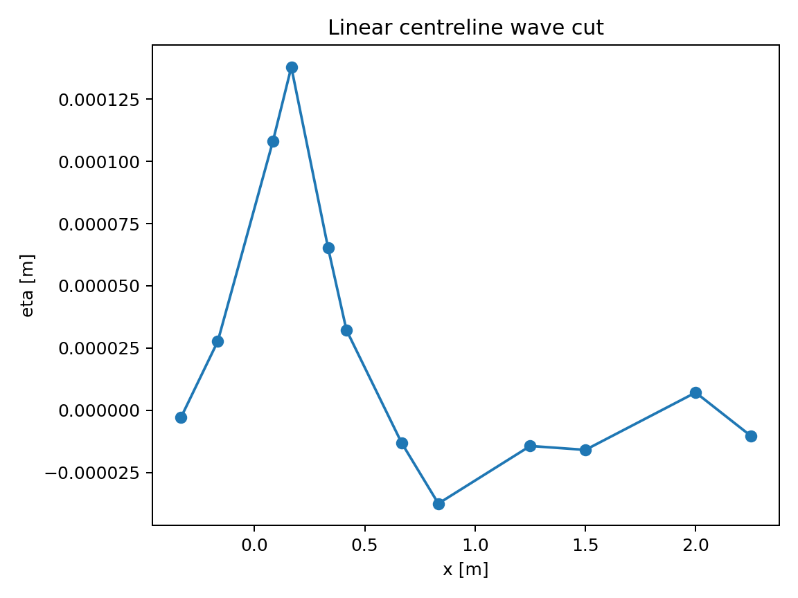
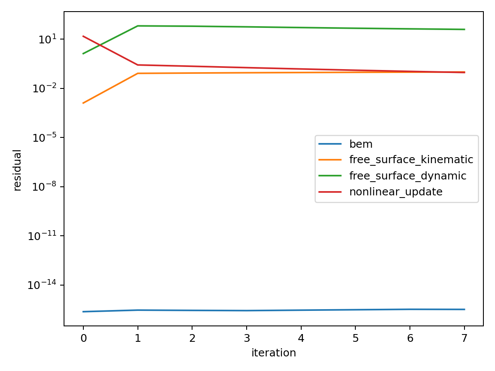

# Demonstration of the restricted exact-body Rankine-panel solver

**Case:** Wigley hull at $Fn=0.30$
**Date:** 18 August 2026
**Formulation:** `rankine-source-v1`

## Executive summary

The complete demonstration workflow ran successfully and produced double-body,
linear free-surface, and fixed-waterline nonlinear results. The double-body
calculation passed every acceptance gate: the algebraic and hull-impermeability
residuals were $O(10^{-16})$, and the integrated axial force was zero to
machine precision. This verifies the signs, panel influence matrix, flux
compatibility, velocity evaluation, and pressure integration for this symmetric
reference case.

The coarse linear calculation solved its discrete equations to machine
precision and produced a finite wave pattern. It was nevertheless rejected
because the pressure and outer momentum-flux resistance estimates differed by
99.80%, far exceeding the prescribed 2% tolerance. The nonlinear continuation
also failed: its update decreased, but neither the kinematic nor dynamic
free-surface residual converged. In accordance with the solver contract, these
failures produced `accepted=False` and no resistance coefficient. This run is
therefore a functional demonstration and diagnostic benchmark, not a validated
wave-resistance prediction.

## 1. Reproduction

From the repository root:

```bash
python -m pip install -e '.[test]'
python examples/nonlinear_wigley.py \
  --quick --fn 0.30 --output reports/wigley_fn030
```

The command constructs the hull, runs the three solvers in sequence, and
exports scalar summaries (`.json`), full fields (`.npz`), nonlinear histories
(`convergence.csv`), and the two figures embedded below.

## 2. Physical and numerical definition

The Wigley hull has length $L=1.0\ \mathrm{m}$, beam
$B=0.1\ \mathrm{m}$, draft $T=0.0625\ \mathrm{m}$, and volume
$2.77333\times10^{-3}\ \mathrm{m^3}$. The metadata reference wetted area is
$S_0=0.148824\ \mathrm{m^2}$. At $Fn=0.30$, with
$g=9.80665\ \mathrm{m\,s^{-2}}$, the speed is

\[
U=Fn\sqrt{gL}=0.939467\ \mathrm{m\,s^{-1}}.
\]

The corresponding steady deep-water wavelength $2\pi U^2/g$ is
$0.56549\ \mathrm{m}$. The example uses water density
$1025\ \mathrm{kg\,m^{-3}}$, a fixed hull attitude, and the repository
coordinate convention: $x$ points aft-to-forward and $z$ is positive
downwards.

This `--quick` case is intentionally very coarse:

| Quantity | Value |
|---|---:|
| Hull vertices / triangular panels | 7 / 8 |
| Free-surface vertices / triangular panels | 23 / 24 |
| Free-surface extent | $-0.5\le x/L\le2.5$, $\lvert y/L\rvert\le0.75$ |
| Triangulated wetted area | $0.142817\ \mathrm{m^2}$ |
| Area difference from metadata reference | 4.04% |
| Nonlinear continuation steps requested | 3 |
| Maximum nonlinear iterations per step | 8 |
| Nonlinear relaxation | 0.1 |

The hull input itself uses 41 longitudinal and 17 vertical offset samples;
the panel mesh is the deliberately reduced CI mesh specified above.

## 3. Governing calculation

The perturbation potential is represented by constant-strength Rankine sources
on oriented triangular panels. Self-panel potential uses a Duffy transform;
panel velocity uses exact edge and solid-angle expressions. The double body is
formed by mirroring the wetted hull in the calm waterplane. The linear solver
couples free-surface potential and elevation and applies an upstream condition,
upwind convection, and downstream/lateral damping. The nonlinear solver moves
the graph surface and blends the linear and exact kinematic/Bernoulli residuals
through homotopy, while fixing the design waterline.

Pressure resistance is integrated over the hull. A separate control-box
momentum-flux calculation provides the far-field estimate. Acceptance requires

\[
|R_p-R_f|\le
\max\{0.02\max(|R_p|,|R_f|),10^{-5}\ \mathrm{N}\}.
\]

The coefficient denominator for this case is
$\tfrac12\rho U^2S_0=67.3179\ \mathrm{N}$. Unaccepted cases retain raw forces for
diagnosis when safe, but publish no coefficient.

## 4. Results

### 4.1 Acceptance summary

| Method | Algebraic | Free surface | Force balance | Mesh | Domain | Accepted |
|---|:---:|:---:|:---:|:---:|:---:|:---:|
| Double body | Yes | Yes | Yes | Yes | Yes | **Yes** |
| Exact-body linear | Yes | Yes | No | Yes | Yes | **No** |
| Fixed-waterline nonlinear | Yes | No | No | Yes | Yes | **No** |

### 4.2 Double-body verification

| Diagnostic | Result |
|---|---:|
| BEM relative residual | $3.15\times10^{-16}$ |
| Maximum nondimensional hull-normal velocity | $2.07\times10^{-16}$ |
| Pressure resistance | $-1.77\times10^{-16}\ \mathrm{N}$ |
| Independent reference resistance | $0\ \mathrm{N}$ |
| Force discrepancy | $1.77\times10^{-16}\ \mathrm{N}$ |
| Pressure coefficient | $-2.63\times10^{-18}$ |

The zero-drag result is the expected d'Alembert regression for a symmetric
double body. Its agreement to roundoff is the strongest positive result of the
demonstration.

### 4.3 Linear free surface

| Diagnostic | Result |
|---|---:|
| BEM relative residual | $5.32\times10^{-16}$ |
| Hull impermeability residual | $1.73\times10^{-16}$ |
| Free-surface kinematic residual | $4.51\times10^{-16}$ |
| Free-surface dynamic residual | $2.05\times10^{-2}$ |
| Elevation range | $[-3.743,13.803]\times10^{-5}\ \mathrm{m}$ |
| Pressure resistance $R_p$ | $3.2611\times10^{-4}\ \mathrm{N}$ |
| Momentum-flux resistance $R_f$ | $1.66076\times10^{-1}\ \mathrm{N}$ |
| Absolute discrepancy | $1.65750\times10^{-1}\ \mathrm{N}$ |
| Relative discrepancy | 99.80% |

The raw diagnostic coefficients would be $4.84\times10^{-6}$ and
$2.467\times10^{-3}$, respectively. They are intentionally replaced by NaN
in the public result because the force-balance gate failed.



The extracted wave cut shows a small bow-region crest followed by a trough and
a damped downstream disturbance. Its maximum sampled elevation is about
$0.138\ \mathrm{mm}$. Given the exceptionally coarse free-surface mesh, the
curve demonstrates data flow and radiation damping but is not a converged wave
profile.

For comparison only, the unchanged Michell solver on the 41-by-17 offset grid
converged at the same Froude number and returned
$R_W=0.143805\ \mathrm{N}$ and $C_W=2.1362\times10^{-3}$. This is close in
scale to the BEM momentum-flux estimate, but Michell is not used to calibrate or
accept the BEM solution.

### 4.4 Nonlinear continuation

The nonlinear stage completed eight iterations at the first continuation
stage and then stopped. Its BEM and hull-normal residuals remained at
$O(10^{-16})$, showing that each inner panel solve was algebraically accurate.
However, the nonlinear physics did not converge:

| Diagnostic | Initial | Final | Behaviour |
|---|---:|---:|---|
| Nonlinear update norm | 15.107 | 0.0931 | Decreased, above 0.05 tolerance |
| Kinematic residual | 0.00128 | 0.0999 | Increased |
| Dynamic residual | 1.331 | 39.771 | Increased after peaking at 65.239 |
| Waterline error | 0 | 0 | Fixed constraint satisfied |
| Maximum graph-slope indicator | $3.39\times10^{-4}$ | $5.26\times10^{-5}$ | Geometrically admissible |

The final elevation range was
$[-3.239,1.941]\times10^{-5}\ \mathrm{m}$. Because continuation diverged,
the solver suppressed both force values and coefficients. The recorded
pre-suppression force discrepancy was $0.84656\ \mathrm{N}$.



The figure separates algebraic convergence from physical free-surface
convergence. It illustrates why a small BEM residual alone cannot justify
accepting a nonlinear result.

## 5. Conclusions and required next work

This case demonstrates that the complete API, meshing, panel assembly,
double-body solve, linear solve, nonlinear continuation, diagnostics, exports,
and failure safeguards execute end to end. It also demonstrates that the
current quick mesh is insufficient for resistance prediction.

Before using the method quantitatively, the following release gates remain:

1. repeat the case on at least three systematically refined hull/free-surface
   meshes;
2. repeat it on at least two extended free-surface domains;
3. establish stable linear wave phase and amplitude under both refinements;
4. reduce pressure/momentum-flux disagreement below 2%;
5. continue the nonlinear system through λ=1 with decreasing kinematic and
   dynamic residuals; and
6. verify the resulting nonlinear force balance independently.

Until these conditions are met, the accepted double-body result is suitable
for core verification, while the linear and nonlinear outputs should be used
only for debugging and convergence development.

## 6. Output inventory

- `double_body_rankine_bem.json` and `.npz`: accepted double-body summary and fields;
- `linear_exact_body_rankine_bem.json` and `.npz`: linear diagnostics and fields;
- `nonlinear_exact_body_rankine_bem_fixed_waterline.json` and `.npz`: failed
  nonlinear state and full histories;
- `convergence.csv`: iteration-by-iteration nonlinear residuals;
- `wave_elevation.png`: linear centreline-limit wave cut;
- `convergence.png`: nonlinear residual plot.

The mathematical and sign conventions are specified separately in
`docs/NONLINEAR_SOLVER_DESIGN.md`.
