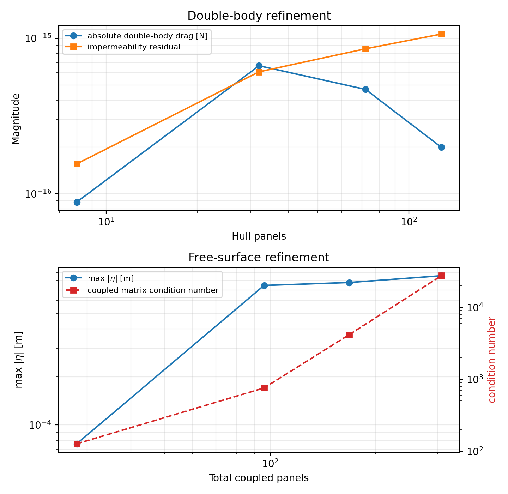
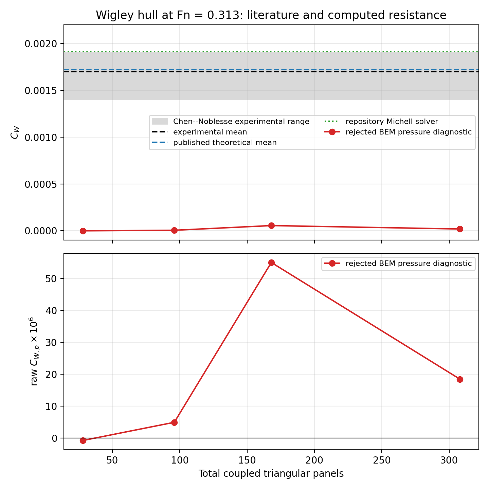
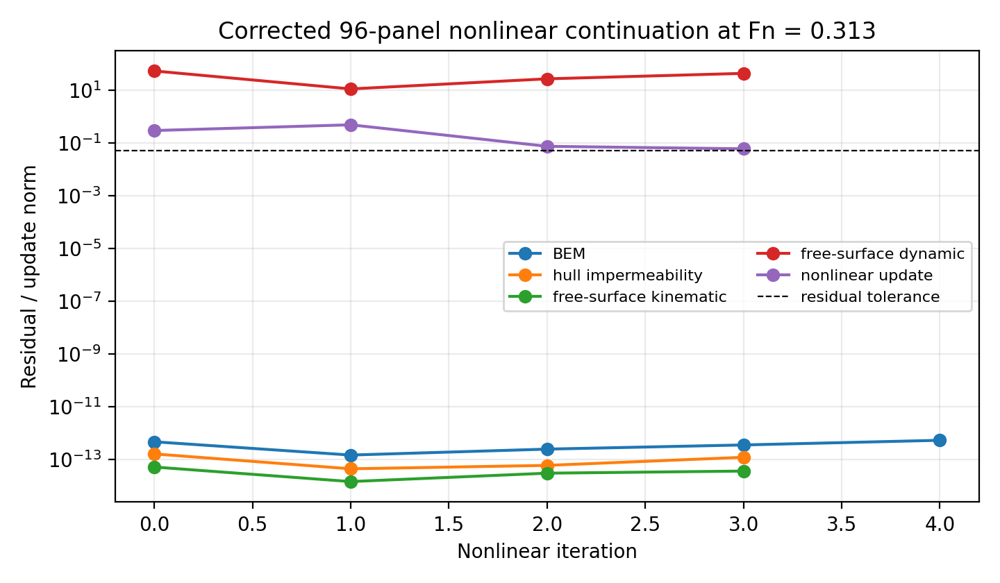

# Corrected code review, refinement, and literature comparison

**Case:** standard Wigley hull, $Fn=0.313$
**Date:** 18 August 2026
**Formulation:** `rankine-source-v1`

## Executive finding

The review found and corrected several implementation defects, including a
major orientation error: the port free-surface panels pointed into the fluid
while the starboard panels pointed into air. The linear kinematic matrix also
had the wrong sign for the documented normal convention. Mesh, rank,
nonlinear-update, and acceptance diagnostics were strengthened accordingly.

After correction, all automated tests pass and the double-body solution remains
correct to roundoff. The linear free-surface equations have residuals below
$1.4\times10^{-12}$, but their pressure resistance is not mesh converged.
The raw $C_{W,p}$ changes non-monotonically from
$-0.78\times10^{-6}$ to $55.0\times10^{-6}$ and then
$18.5\times10^{-6}$. These values are far below the published Wigley range.
The nonlinear L1 case also fails its dynamic-residual and slope gates.

Therefore the corrections improve mathematical consistency and failure
reporting, but they do not validate the free-surface resistance solver. No BEM
resistance coefficient from this study is accepted.

## 1. Corrections

1. **Free-surface orientation.** Port and starboard panels now both point into
   air ($n_z<0$); shared centreline edges have opposite orientations in their
   adjacent triangles.
2. **Linear kinematic sign.** With $z$ positive downward,
   $\boldsymbol U_\infty=(-U,0,0)$, and the free-surface normal pointing into
   air, the implemented condition is now
   $\boldsymbol n\cdot\nabla\phi-U\eta_x=0$, equivalent to
   $\phi_z+U\eta_x=0$.
3. **Waterline conformity.** Domain-grid stations inside $0\le x\le L$ no
   longer create free-surface waterline vertices absent from the hull mesh.
4. **Linear algebra acceptance.** Rank detection is separated from residual
   tolerance. Rank deficiency is allowed only for the compatible closed-body
   Neumann solve, and the condition-number limit is enforced.
5. **Surface-velocity jump.** Nonlinear free-surface velocity uses the
   fluid-side $+\sigma/2$ source-sheet limit, consistent with collocation.
6. **Nonlinear graph update.** Face targets are projected to constrained vertex
   elevations. Fixed boundaries cannot drift, excessive-slope updates are
   backtracked, and physical residuals are required for convergence.
7. **Mesh diagnostics.** Shared-edge orientation, free-surface topology, graph
   slope, and waterline conformity now enter result metadata and acceptance.
   Bow, stern, and waterline refinement settings are active.
8. **Force gate.** The previous rectangular control-box flux intersected the
   Rankine source sheet and omitted gravity/free-surface closure terms. It is no
   longer used as an independent force estimate. The far-field value is NaN
   until a verified Kochin or closed flux formulation is implemented.

## 2. Reference case

The Wigley hull has $L/B=10$, $L/T=16$, $L=1\ \mathrm{m}$, and reference
wetted area $S_0=0.14882425\ \mathrm{m^2}$. At $Fn=0.313$,
$U=0.9801774\ \mathrm{m\,s^{-1}}$, giving

\[
\tfrac12\rho U^2S_0=73.27856\ \mathrm{N}.
\]

The free-surface domain is fixed at
$-0.5\le x/L\le2.5$, $|y/L|\le0.75$.

## 3. Double-body verification

| Level | Hull triangles | $|R_x|$ [N] | Condition number | BEM residual | Impermeability | Accepted |
|---|---:|---:|---:|---:|---:|:---:|
| L0 | 8 | $8.85\times10^{-17}$ | 14.5 | $2.33\times10^{-16}$ | $1.56\times10^{-16}$ | Yes |
| L1 | 32 | $6.66\times10^{-16}$ | 64.0 | $1.86\times10^{-15}$ | $6.09\times10^{-16}$ | Yes |
| L2 | 72 | $4.69\times10^{-16}$ | 63.3 | $2.69\times10^{-15}$ | $8.57\times10^{-16}$ | Yes |
| L3 | 128 | $1.99\times10^{-16}$ | 87.5 | $3.09\times10^{-15}$ | $1.06\times10^{-15}$ | Yes |

The zero-drag result is resolution independent to roundoff and confirms the
closed-body kernel, hull orientation, jump, and pressure-force convention.

## 4. Corrected linear refinement

The coefficients below are raw pressure diagnostics. Public coefficient fields
remain NaN because the independent-force gate is unavailable.

| Level | Hull panels | FS panels | Total | Raw $C_{W,p}$ | Condition number | $\max|\eta|$ [m] | Accepted |
|---|---:|---:|---:|---:|---:|---:|:---:|
| L0 | 8 | 20 | 28 | $-7.82\times10^{-7}$ | $1.27\times10^2$ | $7.62\times10^{-5}$ | No |
| L1 | 32 | 64 | 96 | $4.93\times10^{-6}$ | $7.59\times10^2$ | $7.47\times10^{-4}$ | No |
| L2 | 72 | 96 | 168 | $5.50\times10^{-5}$ | $4.16\times10^3$ | $7.79\times10^{-4}$ | No |
| L3 | 128 | 180 | 308 | $1.85\times10^{-5}$ | $2.74\times10^4$ | $8.59\times10^{-4}$ | No |

All four systems are full-rank under the numerical criterion. Their BEM,
hull-impermeability, kinematic, and dynamic equation residuals remain small.
Nevertheless, pressure resistance is non-monotone, changes by factors much
larger than 2%, and has no identifiable asymptotic range. The coupled condition
number grows by more than two orders of magnitude.

## 5. Literature comparison

Chen and Noblesse compiled Wigley experimental and theoretical results. An open
KTH report summarises their $Fn=0.313$ values as experimental mean
$C_W=1.70\times10^{-3}$, range
$1.4\times10^{-3}\le C_W\le1.9\times10^{-3}$, and theoretical mean
$1.72\times10^{-3}$. Only these summary values are reproduced. The repository
Michell solver gives $C_W=1.9119\times10^{-3}$ without calibration.

The corrected BEM pressure sequence lies 31–2200 times below the experimental
mean in magnitude and is not converged. This is numerical failure, not evidence
of a physical finite-breadth correction.

Sources:

1. C. Y. Chen and F. Noblesse, “Comparison Between Theoretical Predictions of
   Wave Resistance and Experimental Data for the Wigley Hull,” *Journal of
   Ship Research*, 27(4), 215–226 (1983),
   [doi:10.5957/jsr.1983.27.4.215](https://doi.org/10.5957/jsr.1983.27.4.215).
2. J. L. Ortín Montesinos, *Hydrodynamic Modelling of Hulls Using RANSE
   Codes*, Figure 22,
   [open repository copy](https://www.diva-portal.org/smash/get/diva2%3A1236507/FULLTEXT01.pdf).

## 6. Corrected nonlinear rerun

The 96-panel L1 nonlinear run remains algebraically converged but physically
failed. Four accepted graph updates were completed before every admissible
backtracked fifth update exceeded the slope limit.

| Diagnostic | Observed range | Assessment |
|---|---:|---|
| BEM residual | $1.49\times10^{-13}$–$4.74\times10^{-13}$ | converged |
| Hull impermeability | $4.49\times10^{-14}$–$1.64\times10^{-13}$ | converged |
| FS kinematic | $1.47\times10^{-14}$–$5.24\times10^{-14}$ | converged |
| FS dynamic | 11.1–53.3 | failed |
| Update norm | 0.0600–0.486 | failed ($\epsilon=0.05$) |
| Maximum accepted slope | 0.599 | at the 0.6 limit |
| Waterline error | 0 | satisfied |

No nonlinear resistance or coefficient is reported.

## 7. Conclusion and remaining work

The corrections eliminate demonstrable sign, orientation, conformity, rank,
and false-convergence defects. They also show that the earlier refinement
results were contaminated by the port-half orientation error and an invalid
force estimator. The corrected free-surface pressure result remains
underresolved or inconsistently discretised; increasing panel count does not
establish convergence.

Before a validation claim, the implementation still requires:

1. a verified solved-field Kochin or complete momentum/energy-flux estimator;
2. a manufactured radiating-wave test of the assembled free-surface operator;
3. fixed-aspect-ratio mesh and independent domain-extension sequences;
4. a better-conditioned radiation/stabilisation formulation; and
5. a nonlinear method whose dynamic residual converges at $\lambda=1$.

Detailed values are stored in `refinement_results.csv`,
`double_body_refinement.csv`, and `nonlinear_L1.npz`; the figures are
generated by `plot_refinement.py`.
